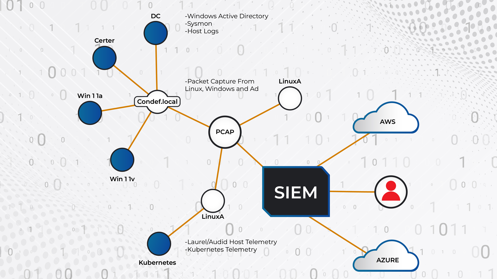
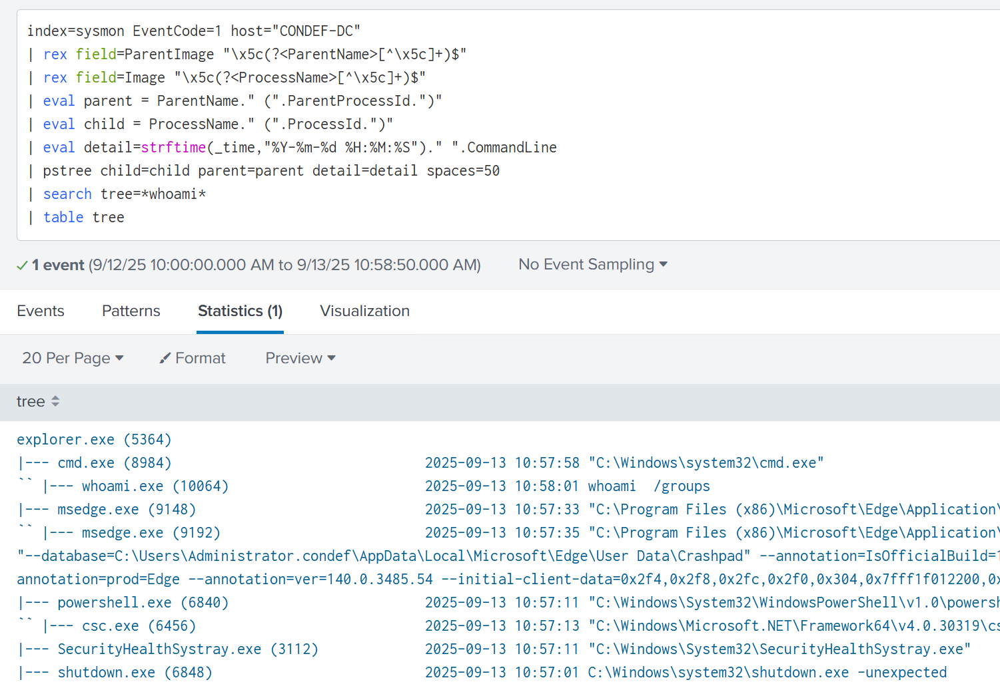
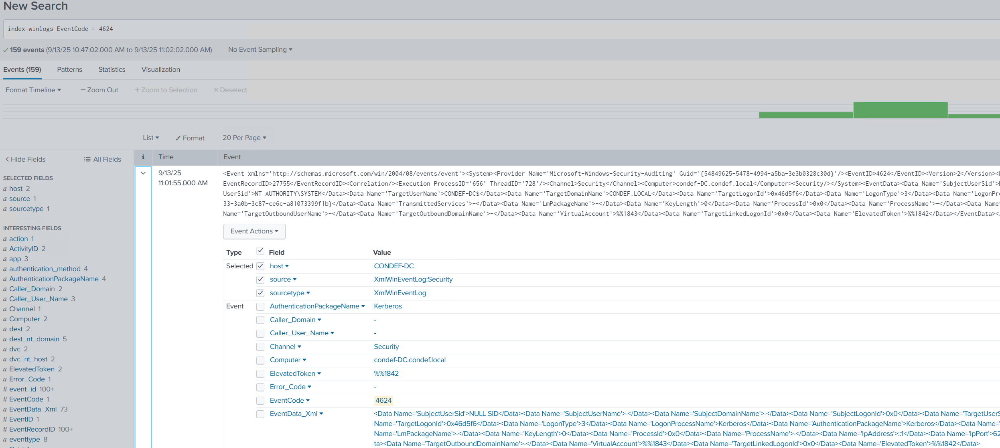
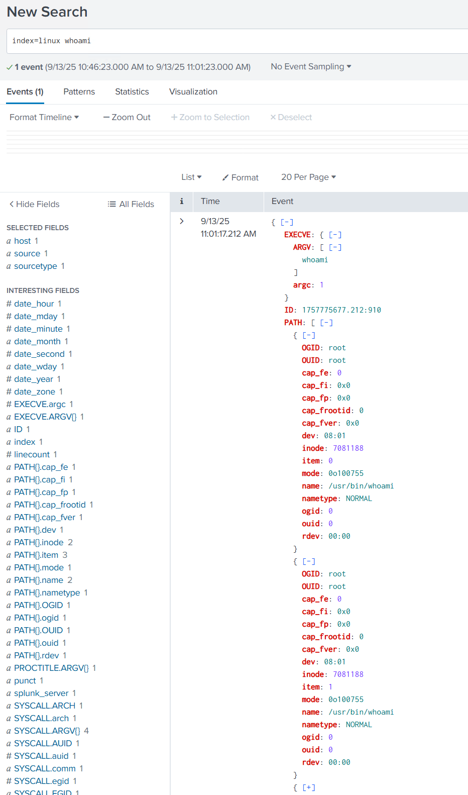
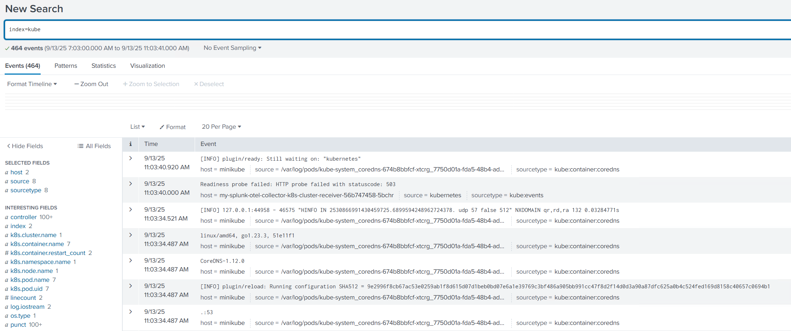
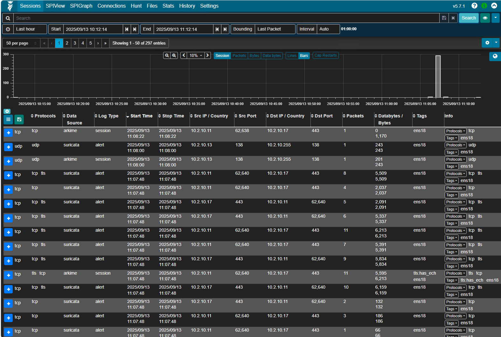
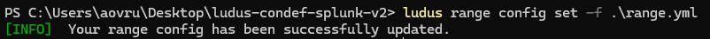
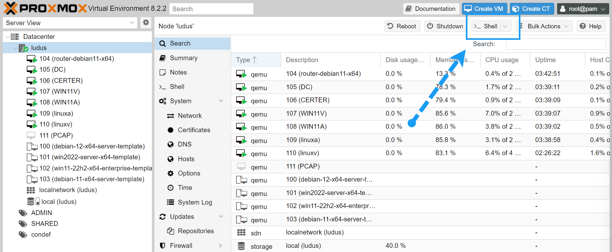

# Constructing Defense Ludus Range


Thanks for checking out the Constructing Defense Ludus Range!

## What is this exactly ?

The Constructing Defense Ludus Range is a set of files that work with [Ludus](https://ludus.cloud/) to help you deploy a telemetry-filled lab with minimal setup.

The lab deploys the following components:

| Component | Purpose | Telemetry |
|-----------|---------|-----------|
| DC.condef.local | Serves as domain controller for Active Directory portion of the lab | - Windows Events<br>- Active Directory Telemetry (Kerberos, Certificate Services etc)<br>- Host-based (Sysmon, Native Windows Events) |
| Certer.condef.local | Serves as Active Directory Certificate Services (ADCS) Server for the domain | - Certificate / PKI related telemetry |
| Win11a.condef.local | The "attacker" host, where tools will be built and utilized | - Host-based/Sysmon |
| Win11v.condef.local | The "victim" host, will be the target of attacks | - Host-based/Sysmon |
| Linux | The "attacking" Linux machine | - Laurel/Auditd |
| LinuxV | The "victim" Linux machine, will be the target for Linux-based attacks, also hosts a local Kubernetes cluster | - Laurel/Auditd |
| PCAP | Malcolm PCAP sensor for Zeek/Suricata, will be monitoring both Linux and AD traffic | - PCAP, Zeek, Suricata |
| SIEM | Splunk (500MB Daily Limit) | - Windows Events (Sysmon, Active Directory, Certificate Services)<br>- Linux Telemetry (Laurel/Auditd)<br>- Kubernetes Telemetry<br> |



( _Please note, the AWS/Azure components are optional and require manual set up and are not included in this version of the lab, instructions for setting up cloud collection are provided in the paid versions of Constructing Defense_ )

The lab is designed to act as a playground for cybersecurity research; be it blue/red/purple or just messing around.

Once the lab is set up, you will have a Splunk instance full of interesting telemetry like:

- Windows Events
- Active Directory Certificate Services Events
- Sysmon
- Linux telemetry via auditd, transformed to readable JSON with [Laurel](https://github.com/threathunters-io/laurel) 
- Kubernetes audit logging coming from a local Minikube cluster
- Full packet capture capabilities - including Zeek & Suricata via [Malcolm](https://malcolm.fyi/)

## Screenshots 

Sysmon telemetry viewed through a process tree in Splunk:




Ingested Active Directory / Windows events in Splunk:



Auditd Linux telemetry processed with Laurel:



Kubernetes telemetry via Minikube local cluster: 



Malcolm / Arkime full packet capture:



## Cool! How do I use it ?

### Ludus Setup

Before using this lab, you need to ensure that Ludus is properly configured & set up. You will need the following:

1) A Ludus server provisioned and set up, as per the instructions found here: <https://docs.ludus.cloud/docs/quick-start/install-ludus>

2) A Ludus user created, with appropriate API keys and WireGuard configuration, as per the instructions here: <https://docs.ludus.cloud/docs/quick-start/create-a-user>

3) The following templates built, as per the instructions here: <https://docs.ludus.cloud/docs/quick-start/build-templates>

```
debian-11-x64-server-template
debian-12-x64-server-template
win11-22h2-x64-enterprise-template
win2022-server-x64-template
```


4) The [Ludus CLI](https://docs.ludus.cloud/docs/quick-start/using-cli-locally) configured and set up


Once you have the above four requirements set up, and you are the point of being able to deploy a range, download the following files which contain the Constructing Defense Ludus range configuration and custom roles.

### Range Set up

Once you have Ludus set up and all the relevant templates built out, you can grab the `ludus-condef-splunk-v2.7z` file from this repo & unzip it.

Once you have all the files unzipped to your host, we need to install the roles:

```
ludus.exe ansible role add -d .\roles\role_gpo_deploy\
ludus.exe ansible role add -d .\roles\role_linux_logging\
ludus.exe ansible role add -d .\roles\role_minikube\
ludus.exe ansible role add -d .\roles\role_splunk_collector_certer\
ludus.exe ansible role add -d .\roles\role_splunk_collector_linuxv\
ludus.exe ansible role add -d .\roles\role_splunk_collector_win11a\
ludus.exe ansible role add -d .\roles\role_splunk_collector_win11v\
ludus.exe ansible role add -d .\roles\role_splunk_install\
ludus.exe ansible role add -d .\roles\role_sysmon_install\
ludus.exe ansible role add -d .\roles\role_k8s_telemetry_collection\
ludus.exe ansible role add -d .\roles\role_splunk_hec_validate\
ludus.exe ansible role add -d .\roles\role_malcolm_install\
ludus.exe ansible role add ansible roles add badsectorlabs.ludus_adcs
```

Note here that your `ludus.exe` may be named differently. When running this commands, ensure that you inside the `ludus-condef-splunk-v2` directory as well. 

Next up, we need to tell Ludus which range config to use. We can use the following command:

`.\ludus.exe range config set -f .\range.yaml`



Note that your `ludus.exe` file may be named differently depending on how you installed the client or whether you are deploying from a Linux machine.

You can now run a `ludus.exe ansible roles list` command and your roles should match the following:


We can now deploy the range: `ludus.exe range deploy`

You can monitor the logs for the range with: `ludus.exe range logs -f`

If there are any errors with the deploy, you can view them with: `ludus.exe range errors`

After the lab is deployed, I found there are less issues if you shut all the VMs down and power them back on in a certain order:

* Router first
* Domain Controller second
* Rest of the VMs third

After the lab is deployed, we will need to tweak Proxmox slightly to enable packet capture.

Open up a `root` shell on your Proxmox host:



And enter the following commands:

`brctl setageing vmbr1002 0`

`ip link set vmbr1002 promisc on`

No reboot should be necessary for these changes to take affect.


### Credentials

- Splunk instance ( http://dc:8000 )

user: `condef`
password: `Temp1234!!`

- Windows Hosts

user: `Administrator`
password: `Temp1234!!`

- Linux Hosts

user: `debian`
password: `debian`

- Malcolm ( https://10.2.10.17 )
user: `condef`
password: `Temp1234!!` 


## Hardware Requirements 

The Ludus host that was used for creation the Ludus version of the Constructing Defense lab had the following specs:

* 64GB RAM
* 16 CPU Cores
* 400GB Disk

Depending on where you are running Ludus, you may need fewer or additional resources.

### I don't have the hardware to run this lab, what can I do ? 

You may be able to provision the lab on a host with 32GB of RAM and less CPU cores. The PCAP appliance Malcolm requires the most resources, so if you have a less provisioned host, you can choose not to run the Malcolm appliance.

If you don't want to deploy Malcolm, comment out the following block within your `range.yml` file:

```yaml
  - vm_name: "{{ range_id }}-pcap"
    hostname: "{{ range_id }}-pcap"
    template: debian-12-x64-server-template
    vlan: 10
    ip_last_octet: 17
    ram_gb: 32
    cpus: 6
    linux: true
    roles:
      - role_malcolm_install
```

to 

```yaml
  #- vm_name: "{{ range_id }}-pcap"
   # hostname: "{{ range_id }}-pcap"
   # template: debian-12-x64-server-template
   # vlan: 10
   # ip_last_octet: 17
   # ram_gb: 32
   # cpus: 6
   # linux: true
   # roles:
   #   - role_malcolm_install
```

The lab - alongside the full Constructing Defense course - is available on justhacking.com: 

https://www.justhacking.com/course/constructing-defense/ 

This is the exact same lab as is deployed here, but running in the cloud accessible through your web browser.

### I want to use this lab for something, but don't know where to start

If you have the hardware for the lab, but don't know where to start, check out Constructing Defense Lite here: 

https://www.justhacking.com/course/condef-lite/

This version of the course includes a bunch of lessons showing you how to utilize this lab for a very affordable price! 

## Support

This lab is provided free for the community in an "as-is" fashion. There are a ton of moving pieces involved and maintaining/testing the lab is a very time consuming process. Therefore, support will be provided on a best-effort basis.

## Pull Requests

See something broken or that you think needs enhancing? Pull requests are welcome! 

